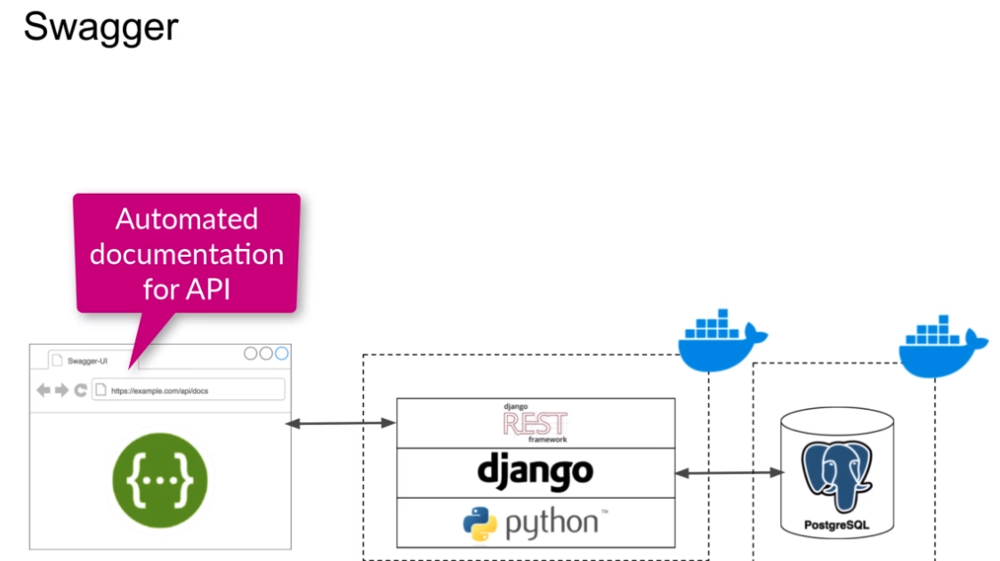
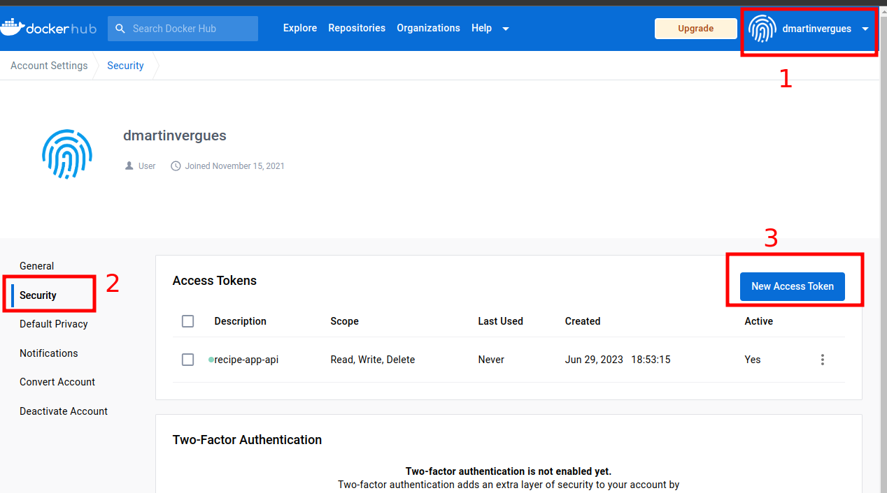
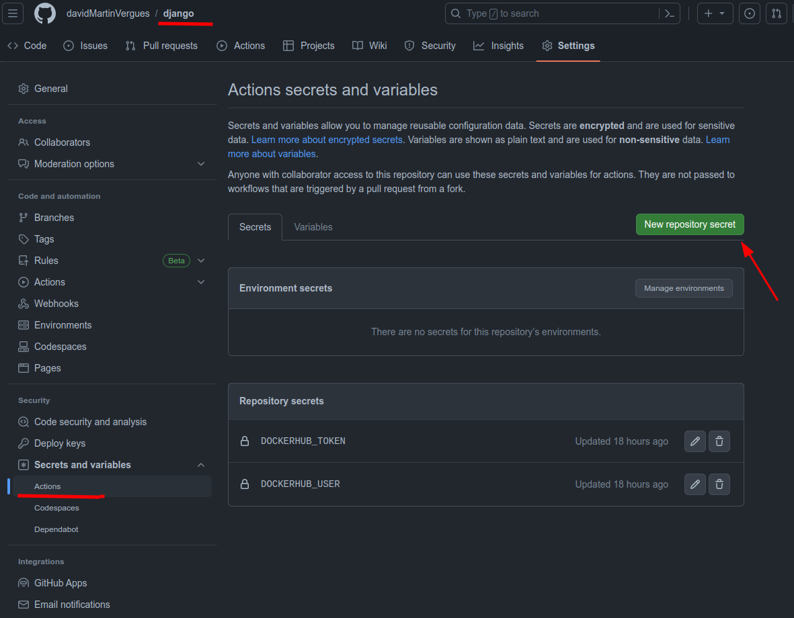
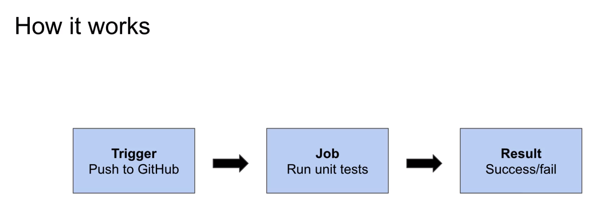

- [Django](#django)


# Curso Django creación Backend REST API

source : [Build a Backend REST API with Python & Django - Advanced (Udemy)](https://www.udemy.com/course/django-python-advanced/)

## Tecnologías que utilizaremos en el curso



También utilizaremos GitHub Actions con el objetivo de lanzar test automáticos cada vez que hagamos push al repo de github.

## Docker

Que beneficios nos trae docker para el desarrollo:

- Mayor consistencia entre el entorno de Desarrollo y producción ya que utilizaremos la misma imagen para ambos.
- Facilidad para colaborar ya que todos tienen las mismas dependencias
- Podemos especificar en archivos todas las dependencias tanto a nivel de SO como de nuestra app (Dockerfile)
- Permite dejar tu equipo local limpio

Para gestionar todas las dependencias y configurar el SSOO utilizaremos el Dockerfile

Con el objetivo de usar las github actions junto con dockerhub debemos configurar un par de cosas:

1. generar token en dockerhub para autenticarnos

si nos pregunta que tipo de permisos le daremos los máximos (ver escribir eliminar)



2. registrar en nuestro repo de github 2 secrets:
   1. nombre del user de dockerhub - por ejemplo seria poner simplemnete "dmartinvergues"
   2. token para acceder a dockerhub



### Docker configuration

* Crear Dockerfile, donde especificaremos todas las dependencias a nivel de Sistema Operativo.
* Docker Compose, define cómo nuestra imagen de docker debe ser usada para ejecutar nuestro servidor de desarollo. Definiremos:
  * Cada imagen será un servicio y cada uno recibirá un nombre
  * puertos de acceso
  * volúmenes

```dockerfile

FROM python:3.9-alpine3.13
LABEL maintainer="David Martin"

ENV PYTHONUNBUFFERED=~~1~~

COPY ./requirements.txt /tmp/requirements.txt
COPY ./app /app
WORKDIR /app
EXPOSE 8000

RUN python -m venv /py && \
    /py/bin/pip install --upgrade pip && \
    /py/bin/pip install -r /tmp/requirements.txt && \
    rm -rf /tmp && \
    adduser \
    --disabled-password \
    --no-create-home \
    django-user

ENV PATH="/py/bin:$PATH"

USER django-user

```

* ENV PYTHONUNBUFFERED 1
    esto es recomendable cuando ejecutamos python en un contenedor docker, esto le dice a python que no debe usar un buffer para la salida de este modo el output de python saldrá por consola

* ENV PATH="/py/bin:$PATH"
    permite añadir nuestro virtual environment a las variables de entorno de SSOO.


También es importante crear un archivo dockerignore para excluir distintos archivos


```dockerignore


# Git
.git
.gitignore

# Docker
.docker

# Python
app/__pycache__/
app/*/__pycache__/
app/*/*/__pycache__/
app/*/*/*/__pycache__/
.env/
.venv/
venv/

```
Finalmente podemos construir la imagen de docker para ello lanzamos el comando de desde la terminal especificando el path dnd se encuentra el **Dockerfile**

```
docker build . -t <images_name>

docker build ./recipe-api -t <images_name>

```
### Dockercompose configuration


ejecutaremos los comandos a traves de docker-compose, por ejemplo

`docker-compose run --rm app sh -c "python manage.py collectstatic"`

- docker-compose: execute a docker-compose 
- run           : start a especific container definido en config
- --rm          : se encarga de eliminar el contenedor una vez se cierra
- app           : es el nombre del service 
- sh -c         : indicamos q pase un comando a la terminal
- "python manage.py collectstatic" : comando a ejecutar en el interior del contenedor

```yml

version: "3.9"

services:
  app:
    build:
      context: .
    image: rest-api-project:latest
    ports:
      - "8000:8000"
    volumes:
      - ./app:/app
    command:
      sh -c "python manage.py runserver 0.0.0.0:8000"
```

1. indicamos la versión del dockercompose para q pueda reconocer la sintaxi
2. "Services" es el bloque principal del dockercompose y puede tener uno o más de uno.
   1. app => es el nombre de nuestro servicio
   2. build -> context: . en esta sección indicamos dónde se encuentra el dockerfile que será las instrucciones para crear la imagen
   3. image => nombre q tendra la imagen resultante
   4. ports -> mapea los puertos del contenedor con los de nuestra máquina en local
   5. volumnes -> los volumenes permiten persistir los datos que se generan dentro del contenedor, esto es bidireccional así que cuando le damos una ruta de nuestro localse copia su contenido en el contenedor y viceversa.
   6. command -> es la instrucción que se ejecutará en el interior del contenedor cuando ejecutemos el docker-compose.


Para ejecutar el docker-compose:

```shell 
docker-compose build
```
esto construirá nuestra imagen docker

### Linting and Tests

#### Linting

Es una herramienta que permite resaltar los errores de sintaxis y errores de formateo.

La herramienta que utilizaremos es:

* flake8 package
* ejecutar este a través de docker-compose, para ello 

```shell
docker-compose run --rm app sh -c "flake8"
```

esta instarucción nos sacara en consola los errores que tenemos en el código.

el flag:

* "docker-compose run" ste es el comando de Docker Compose para ejecutar un contenedor de servicio definido en el archivo docker-compose.yml. La diferencia con `docker-compose up` es que `run` ejecuta un servicio en modo interactivo o temporal (solo por una vez), mientras que `up` levanta y ejecuta los servicios definidos de forma persistente (en segundo plano o primer plano).

* "--rm" permite eliminar el contenedor una vez lo paremos así no vamos dejando contenedores huérfanos.

* sh -c " command" arrancamos el contenedor y ejecutamos en su consola el comando especificado entre comillas.


Lo primero será crear un nuevo archivo de "requirements" pero solo para desarrollo ya que no necesitamos las herramientas de linting en el servidor de despliegue, lo llamaremos "requirements.dev.txt" y contendrá:

```
flake8>=3.9.2,<3.10

```

En nuestro docker-compose añadiremos un argumento

```yml
version: "3.9"

services:
  app:
    build:
      context: .
      args:
        - DEV=true
    ports:
      - "8000:8000"
    volumes:
      - ./app:/app
    command:
      sh -c "python manage.py runserver 0.0.0.0:8000"
```
esto hará que si ejecutamos el dockerfile a través del compose seteará la variable DEV a true y dentro del dockerfile hacmeos:

```dockerfile
FROM python:3.9-alpine3.13
LABEL maintainer="David Martin"

ENV PYTHONUNBUFFERED=1

COPY ./requirements.txt /tmp/requirements.txt
COPY ./requirements.dev.txt /tmp/requirements.dev.txt
COPY ./app /app
WORKDIR /app
EXPOSE 8000

ARG DEV=false

RUN python -m venv /py && \
    /py/bin/pip install --upgrade pip && \
    /py/bin/pip install -r /tmp/requirements.txt && \

    if [$DEV = "true"]; \
      then /py/bin/pip install -r /tmp/requirements.txt ; \
    fi && \

    rm -rf /tmp && \
    adduser \
    --disabled-password \
    --no-create-home \
    django-user

ENV PATH="/py/bin:$PATH"

USER django-user
```
Finalmente vamos a configurar flake8, para ello creamos dentro del directorio del proyecto (no en el root directory) un archivo ".flake8"

```
[flake8]
exclude = 
    migrations,
    __pycache__,
    manage.py,
    settings.py
```
teateamos que flake8 funcione bien y no nos dé ningún error

```shell
docker-compose run --rm app sh -c "flake8"
```
#### Testing

Usaremos la suite para test unitarios q trae django

* Django test suite
* Setup test para Django app
* Ejecutaremos los test a través de docker-compose

```shell
docker-compose run --rm app sh -c "python manage.py test"
```
## Creando el proyecto

1. Creamos nuestro proyecto django "app"

```
docker-compose run --rm app sh -c "django-admin startproject app ."
```
**Puede ser q el comando dé error por falta de permisos en el directorio, para ello `sudo chmod -R 777 ./app`**

2. levantamnos nuestros servicios y ya podremos ver django funcionando

```shell
docker-compose up
```
Si queremos conocer la IP de nuestra maquina dentro de la red de docker para poder conectar x ejemplo un postgres q tengamos en local con nuestro contenedor, 
no podemos usar directamente localhost (127.0.0.1) tenemos q usar la IP de nuestra maquina en la red de docker
y para averiguarlo usamos el comando:

```
ip addr show docker0
```
normalmente `172.17.0.1`

## GitHub Actions

Es una herramienta de automatización parecido a Jenkins. Simplemente github actions permiten ejecutar ciertas tasks automáticamente cuando el código cambia. 

Lo más habitual es sar actions en:

- deployment
- code linting
- lanzar test unitarios

En nuestro caso lo usaremos para pasar test unitarios y code linting.

Para conseguir esto primero debemos configurar un trigger, hay varios pero nosotros usaremos el "push trigger" es decir cuando hagamos un push a github q se ejecuten las acciones.



### Configuración de github actions

1. crear archivo de configuración ".github/workflows/checks.yml"
   1. configurar el trigger
   2. añadir los comandos para ejecutar los tests y el code linting
2. Configurar DockerHub auth

Inciso sobre Docker Hub

Docker Hub es un repositorio de imagenes de docker, cada vez que hacemos `docker push` subimos esa imagen de docker a docker hub, por defecto se pueden hacer 200 push por cada 6 horas (rate limits).  

cuando corremos github actions haremos push a dockerhub por eso necesitamos las credenciales para autenticarnos ya que para tener 200 push x 6 h necesitamos estar autenticados. Como para detectar los push dockerhub lo hace por IP y podemos estar trabajando en varios proyectos es mejor autenticarnos y conseguir estos 200 push

En primer lugar debemos crear el archivo de config en el root directory del proyecto. 
creamos una carpeta `.github` 

`.github/workflows/checks.yml`


```
---
name: Checks

on: [push]

jobs:
  test-lint:
    name: Test and Lint
    runs-on: ubuntu-latest
    steps:
      - name: Login to Docker Hub
        uses: docker/login-action@v2
        with:
          username: ${{ secrets.DOCKERHUB_USER }}
          password: ${{ secrets.DOCKERHUB_TOKEN }}
      - name: Checkout
        uses: actions/checkout@v3
      - name: Test
        run: docker compose run --rm app sh -c "python manage.py test"
      - name: Lint
        run: docker compose run --rm app sh -c "flake8"

```

`runs-on` es el "runner"/la máquina donde se ejecutaran las tasks, github tiene disponibles diferentes runners pero para python lo habitual es ubuntu-20.04 que ya tiene instalado docker-compose

Los `steps` se van ejecutando secuencialmente y solo pasa al siguiente si se ha completado con éxito.

En github actions podemos usar acciones predefinidas en github o crear nuestra action. En `uses` especificaremos qué action queremos usar el nombre `docker/login-action@v1` es una ya predefinida para logearse en dockerhub.

Después del login en dockerhub necesitamos que nuestro código esté disponible para las github actions para ello necesitamos el `step Checkout`

Si alguno de de estos pasos falla el job de github actions fallara tb por lo q no se se subira el proyecto.

Cuango hagamos push de todo el proyecto a github podremos ver las actioins:


ahora cada vez que hagamos un push a github se disparara estas dos comprobacoines (test y linting) si fallan no se subira el codigo?

